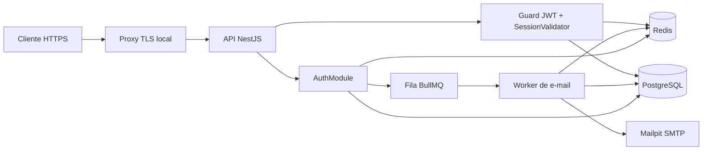

# Design: Autenticação com verificação por e-mail

**SPEC**: `.specs/features/authentication/spec.md`  
**Status**: Fechado e pronto para `tasks.md`  
**Criado em**: 2026-07-13

## Contexto e pesquisa

O repositório contém somente o scaffolding NestJS e a stack Docker de PostgreSQL, Redis e Mailpit. Não há módulos de domínio, conexão com infraestrutura ou padrões de autenticação reutilizáveis. Portanto, esta feature estabelece a primeira estrutura modular da API.

As decisões abaixo seguem a SPEC, `CONTEXT.md` e ADR-0001. A documentação oficial do NestJS confirma o uso de `ValidationPipe` global, guards para proteger rotas, `@nestjs/typeorm` para repositórios e `@nestjs/bullmq` para produtores e consumidores de filas. O TypeORM suporta migrations geradas a partir das entidades; migrations não serão escritas manualmente.

Não há skill `mermaid-studio` disponível neste ambiente; o diagrama abaixo usa Mermaid puro.

## Visão da arquitetura

A aplicação permanece um monólito modular NestJS. O módulo `Auth` contém o fluxo público e expõe somente contratos HTTP. Módulos compartilhados fornecem configuração, persistência, Redis, fila de e-mail, auditoria e segurança. PostgreSQL é a fonte de verdade para toda identidade e revogação; Redis guarda somente estado efêmero, limites e cache de sessões.

O contexto delimitado inicial é `Auth`. Ele é organizado de forma flat, com nomes que deixam explícito o papel de cada arquivo, em vez de criar subdiretórios por camada. A arquitetura hexagonal é aplicada pelas dependências: o domínio e os casos de uso dependem de interfaces próprias, enquanto HTTP, TypeORM, Redis, BullMQ e SMTP são implementações externas.



### Limites de responsabilidade

| Camada | Responsabilidade |
| --- | --- |
| Controller e DTO | Receber requisição, validar contrato e traduzir a resposta HTTP. Sem regras de domínio. |
| Auth service/actions | Orquestrar cadastro, ativação, login, refresh, logout e redefinição em transações. |
| Repositórios | Encapsular consultas e bloqueios do PostgreSQL. |
| Redis stores | Códigos, desafios, contadores, bloqueios, rate limits e cache de sessão. Nunca são fonte de verdade. |
| Session validator/guard | Validar assinatura e claims do JWT, depois confirmar que a sessão continua ativa. |
| Email queue/worker | Gerar segredos transitórios, persistir somente hashes/HMACs e enviar e-mail fora da requisição. |
| Filtro de exceção | Converter exceções conhecidas para o envelope de erro da SPEC, sem vazar segredos. |

## Estrutura de arquivos

```text
src/
  app.module.ts
  main.ts
  environment.validation.ts
  data-source.ts
  database.module.ts
  redis.module.ts
  redis.service.ts
  mail.module.ts
  smtp-mail.service.ts
  email.processor.ts
  api-exception.filter.ts
  modules/
    auth/
      auth.module.ts
      auth.controller.ts
      auth.service.ts
      auth-session.service.ts
      auth.repository.ts
      typeorm-auth.repository.ts
      auth-email.service.ts
      queue-auth-email.service.ts
      auth-state.service.ts
      redis-auth-state.service.ts
      auth-audit.service.ts
      typeorm-auth-audit.service.ts
      password-hasher.service.ts
      bcrypt-password-hasher.service.ts
      auth-crypto.service.ts
      node-auth-crypto.service.ts
      auth-session.guard.ts
      csrf-origin.guard.ts
      auth.dto.ts
      auth.errors.ts
      auth.types.ts
      account.entity.ts
      auth-session.entity.ts
      session-refresh-token.entity.ts
      password-reset-token.entity.ts
      auth-audit-event.entity.ts
      email.value-object.ts
      password.value-object.ts
      password-hash.value-object.ts
      account-status.enum.ts
      account-role.enum.ts
      verification-purpose.enum.ts
  migrations/
```

Arquivos e símbolos técnicos permanecem em inglês. A documentação e mensagens públicas podem ser escritas em português. Um novo subdiretório só é criado quando houver um segundo bounded context ou quando uma família de arquivos deixar de ser navegável no nível flat; não se criam pastas somente para representar camadas.

## Princípios arquiteturais

- **DDD modular**: `Auth` é um bounded context independente. `Account` é o agregado que protege estado da conta e a regra de sessão única; `AuthSession` e `PasswordResetToken` pertencem a esse contexto.
- **Arquitetura hexagonal**: controllers e guards recebem entradas; TypeORM, Redis, BullMQ, SMTP e auditoria são implementações externas. Casos de uso dependem somente de interfaces definidas pelo contexto.
- **SOLID**: cada implementação tem uma responsabilidade; interfaces pequenas evitam que serviços dependam de detalhes de infraestrutura; o módulo injeta concretudes nas bordas.
- **Value Objects**: `Email`, `Password` e `PasswordHash` eliminam primitivas com regras de domínio. São imutáveis, não têm identidade e validam seus próprios invariantes.
- **Object Calisthenics pragmática**: métodos mantêm um único nível de abstração, retornos antecipados evitam condicionais aninhadas e nomes descrevem intenção. Não se introduzem wrappers, classes ou arquivos sem uma regra de domínio ou uma dependência que justifique sua existência.

## Módulos e componentes

### `ConfigModule`

- **Localização**: `src/environment.validation.ts`
- **Responsabilidade**: carregar e validar, no bootstrap, todas as variáveis de ambiente.
- **Interface principal**: provedor tipado de configuração para banco, Redis, JWT, cookies, CORS, SMTP, fila e URLs externas.
- **Regra**: falhar na inicialização se faltar segredo, URL permitida, chave HMAC ou configuração obrigatória em produção.

### `DatabaseModule`

- **Localização**: `src/database.module.ts` e `src/data-source.ts`
- **Responsabilidade**: configurar `TypeOrmModule.forRootAsync`, DataSource para CLI e migrations geradas.
- **Dependências**: `@nestjs/typeorm`, `typeorm`, `pg`.
- **Regra**: `synchronize` permanece desabilitado. O schema é criado e evoluído somente por migrations geradas pelo CLI TypeORM, executadas dentro do container `api`.

### `RedisModule`

- **Localização**: `src/redis.module.ts` e `src/redis.service.ts`
- **Responsabilidade**: expor um cliente Redis compartilhado e operações atômicas usadas por stores de autenticação.
- **Dependências**: `ioredis`.
- **Regra**: nenhuma instância retém códigos, limites ou sessão em memória local.

### `AuthModule`

- **Localização**: `src/modules/auth/auth.module.ts`
- **Responsabilidade**: domínio de identidade, sessão e recuperação de acesso.
- **Exporta**: `AuthSessionGuard` e o tipo de principal autenticado para que módulos futuros protejam suas rotas.
- **Não contém**: regras do domínio de Links, papéis adicionais ou UI.

### `AuthController`

- **Localização**: `src/modules/auth/auth.controller.ts`
- **Responsabilidade**: publicar os nove endpoints sob o prefixo global `/api/v1`.
- **Interfaces**:
  - `register(RegisterDto): 202`
  - `verifyEmail(VerifyEmailDto): 204`
  - `resendEmailVerification(EmailDto): 202`
  - `login(LoginDto): 202`
  - `verifyLogin(VerifyLoginDto): 200`
  - `refresh(): 200`
  - `logout(): 204`
  - `forgotPassword(EmailDto): 202`
  - `resetPassword(ResetPasswordDto): 204`
- **Regra**: o controller configura e remove apenas o cookie de refresh; não conhece entidades TypeORM nem comandos Redis.

### `AuthService`

- **Localização**: `src/modules/auth/auth.service.ts`
- **Responsabilidade**: coordenar cada fluxo usando repositórios, stores e serviços de segurança.
- **Interfaces**:
  - `register(input): Promise<void>`
  - `verifyEmail(input): Promise<void>`
  - `startLogin(input): Promise<LoginChallengeResponse>`
  - `completeLogin(input): Promise<SessionTokens>`
  - `refresh(sessionContext): Promise<SessionTokens>`
  - `logout(sessionContext): Promise<void>`
  - `requestPasswordReset(email): Promise<void>`
  - `resetPassword(input): Promise<void>`
- **Concorrência**: operações que criam ou revogam sessões, rodam refresh e redefinem senha usam transação PostgreSQL e bloqueio pessimista da Conta. Isso serializa logins simultâneos e preserva uma única Sessão Ativa.

### `Email`, `Password` e `PasswordHash`

- **Localização**: `src/modules/auth/email.value-object.ts`, `password.value-object.ts` e `password-hash.value-object.ts`
- **Responsabilidade**:
  - `Email.create(raw)` remove somente espaços das extremidades, converte para minúsculas, valida o formato e expõe o valor canônico usado em unicidade e rate limit;
  - `Password.create(raw)` preserva o valor exatamente recebido, valida a política de força e só o expõe para hashing ou comparação;
  - `PasswordHash.create(hash)` representa o valor persistível e valida que ele é um hash bcrypt aceito.
- **Regra**: os Value Objects são imutáveis. `Password` existe apenas durante o caso de uso e não entra em entidades, logs, filas ou erros. `PasswordHash` é o único valor de senha entregue à persistência.

### Interfaces e implementações externas

- **Localização**: interfaces e implementações concretas no nível flat de `src/modules/auth/`.
- **Responsabilidade**:
  - `AuthRepository` abstrai contas, sessões, refresh tokens, resets e transações; `TypeormAuthRepository` é sua implementação;
  - `AuthStateService` abstrai códigos, desafios, rate limits, bloqueios, cooldowns e cache de sessão; `RedisAuthStateService` é sua implementação;
  - `AuthEmailService` agenda mensagens assíncronas sem conhecer BullMQ; `QueueAuthEmailService` é sua implementação;
  - `AuthAuditService` registra eventos sanitizados; `TypeormAuthAuditService` é sua implementação;
  - `PasswordHasherService` transforma `Password` em `PasswordHash` e verifica correspondência; `BcryptPasswordHasherService` é sua implementação;
  - `AuthCryptoService` gera segredos aleatórios, HMACs e hashes de tokens; `NodeAuthCryptoService` é sua implementação.
- **Regra**: `AuthService` recebe somente interfaces. As implementações TypeORM, Redis, BullMQ, auditoria, bcrypt e `node:crypto` não expõem seus tipos ao domínio.

### `AuthStateService` e Redis

- **Localização**: `src/modules/auth/auth-state.service.ts` e `redis-auth-state.service.ts`
- **Responsabilidade**: expor operações atômicas de uso único, cooldown, tentativas e bloqueios.
- **Regra**: falha de Redis nesses controles aborta o endpoint com `503`; não há fallback permissivo para PostgreSQL.

### `AuthSessionService` e `AuthSessionGuard`

- **Localização**: `src/modules/auth/auth-session.service.ts` e `auth-session.guard.ts`
- **Responsabilidade**:
  - emitir e rotacionar tokens;
  - revogar sessões no PostgreSQL;
  - popular e invalidar cache de sessão;
  - validar JWT Bearer e confirmar sessão ativa antes de liberar rota protegida.
- **Regra**: o guard não confia exclusivamente em cache positivo. Se a chave Redis não existir ou Redis falhar, consulta PostgreSQL e tenta repopular o cache. Ao retornar logout, refresh reutilizado, novo login ou reset, a transação de revogação e a invalidação do cache já foram concluídas.

### `AuthEmailService` e `EmailProcessor`

- **Localização**: `src/modules/auth/auth-email.service.ts`, `queue-auth-email.service.ts` e `src/email.processor.ts`
- **Responsabilidade**: enfileirar e processar os tipos `send-verification-code` e `send-password-reset`.
- **Dependências**: `@nestjs/bullmq`, `bullmq`, `nodemailer`.
- **Regra crítica**: jobs carregam somente IDs, propósito e `issuanceId`, nunca códigos nem tokens. O worker gera o segredo em memória, persiste apenas seu HMAC/hash, envia o e-mail e descarta o valor. Antes de executar, valida que seu `issuanceId` ainda é a emissão vigente; jobs antigos terminam sem gerar segredo. Em retry da emissão vigente, um novo segredo é gerado e invalida o anterior.
- **Execução**: o serviço `queue-worker` inicia o mesmo artefato Nest em modo worker; não expõe porta HTTP.

## Modelo de dados

### PostgreSQL

| Entidade | Campos principais | Índices e regras |
| --- | --- | --- |
| `users` | `id` UUID público, `email`, `status`, `role`, `passwordHash`, `createdAt`, `updatedAt` | `email` canônico único; `status` = `PENDING` ou `ACTIVE`; `role` = `USER`. |
| `auth_sessions` | `id` (`sessionId` UUID v4), `userId`, `refreshTokenHash`, `csrfTokenHash`, `expiresAt`, `revokedAt`, `revocationReason`, `createdAt`, `lastRotatedAt` | índice por `userId` e sessão ativa; a Conta bloqueada na transação garante somente uma sessão válida. |
| `session_refresh_tokens` | `id`, `sessionId`, `tokenHash`, `issuedAt`, `usedAt`, `expiresAt` | `tokenHash` único. Retém cada hash da família até expirar, permitindo detectar reutilização de qualquer refresh rotacionado. |
| `password_reset_tokens` | `id`, `userId`, `tokenHash`, `expiresAt`, `usedAt`, `createdAt` | índice por `userId`; novo token marca tokens anteriores como usados/inválidos. |
| `auth_audit_events` | `id`, `userId` opcional, `type`, `sessionId` opcional, `ipHash` opcional, `createdAt`, `metadata` sanitizado | sem senha, código, token, e-mail bruto ou conteúdo de cabeçalhos. |

O token opaco de reset pertence ao e-mail; como o fragmento não é transmitido ao servidor, o frontend futuro lê `#token=...` e o envia no corpo de `POST /reset-password`.

### Redis

Prefixo obrigatório: `shortlink:auth:`. Cada valor usa JSON mínimo e TTL nativo; secrets usam HMAC/hash.

| Chave | Conteúdo permitido | TTL |
| --- | --- | --- |
| `verification:activation:{userId}` | HMAC do código, tentativas e `resendAvailableAt` | 1 hora |
| `verification-issuance:activation:{userId}` | `issuanceId` vigente do envio de ativação | 1 hora |
| `login-challenge:{challengeId}` | `userId`, HMAC do código, expiração e uso | 1 hora |
| `login-challenge:account:{userId}` | `challengeId` vigente para invalidação por novo login | 1 hora |
| `verification-issuance:login:{challengeId}` | `issuanceId` vigente do código de login | 1 hora |
| `reset-issuance:{userId}` | `issuanceId` vigente do e-mail de redefinição | 1 hora |
| `resend:{purpose}:{userId}` | marcador de cooldown | 60 segundos |
| `failed-login:{userId}` | contador combinado de senha e código | 1 hora |
| `login-lock:{userId}` | marcador de bloqueio | 1 hora |
| `rate:{operation}:email:{emailHash}` | contador do limite por e-mail | 1 hora ou 15 minutos |
| `rate:{operation}:ip:{ipHash}` | contador do limite por IP | 1 hora ou 15 minutos |
| `session:{sessionId}` | estado ativo, `userId`, papel e expiração, sem refresh/CSRF | até `expiresAt` |

Scripts Lua ou comandos condicionais (`SET ... NX`, `INCR` com TTL e deleção condicional) mantêm atômicos o consumo do código, a criação do bloqueio e a rotação observada pelo Redis. A decisão definitiva sobre revogação continua no PostgreSQL.

## Fluxos e concorrência

### Cadastro e ativação

1. Normalizar e-mail com `trim().toLowerCase()`; validar formato, política de senha e confirmação.
2. Aplicar limites de cadastro no Redis. Conta ativa recebe `202` genérico sem e-mail. Conta pendente preserva senha; durante o cooldown, cadastro e reenvio retornam `202` genérico e não enfileiram novo envio. O limite de três envios por hora retorna `429` para qualquer e-mail.
3. Para conta nova, criar `users` com estado `PENDING` em transação.
4. Para uma emissão permitida, gravar `issuanceId` vigente, invalidar o código prévio da finalidade e enfileirar job com `userId`, finalidade e `issuanceId`. O worker só processa a emissão ainda vigente, gera o código, grava seu HMAC com TTL e envia pelo Mailpit.
5. `verify-email` consome atomica e exclusivamente o código de `verification:activation:{userId}` e, em transação, muda a conta para `ACTIVE`.

### Login e sessão

1. Aplicar limite por IP/e-mail; localizar conta pelo e-mail canônico.
2. Senha inválida incrementa o contador combinado, mas retorna `401` genérico. Conta pendente com senha válida retorna `403 EMAIL_NOT_VERIFIED`.
3. Senha válida gera `challengeId` e `issuanceId` aleatórios, invalida o desafio anterior da conta, cria estado efêmero e enfileira job sem código. O worker só executa se o `issuanceId` do desafio ainda for vigente. A resposta `202` contém `challengeId` e expiração.
4. `verify-login` consome desafio e código atomicamente. Cinco falhas combinadas ativam `login-lock`.
5. Em transação com lock da Conta, revogar sessões anteriores, criar sessão, refresh token, histórico inicial e auditoria. Após commit, gravar cache de sessão, configurar cookie e retornar access token/JWT e CSRF.

### Refresh, logout e revogação

1. `CsrfOriginGuard` exige `X-CSRF-Token` e ao menos `Origin` ou `Referer` permitido, antes de chamar o serviço.
2. `refresh` localiza a sessão pelo hash do cookie. Se o hash pertence ao histórico e já foi usado, revoga a sessão e invalida o cache.
3. Com lock na sessão, marcar token atual como usado, emitir novo refresh token, atualizar hash atual e inserir seu histórico. Retornar apenas novo access token; o cookie recebe o refresh rotacionado.
4. `logout`, novo login e reset marcam `revokedAt` no PostgreSQL e removem `session:{sessionId}` antes da resposta.
5. O JWT contém `sub` (ID público da conta), `role`, `sessionId`, `iat` e `exp` de 15 minutos. O guard verifica assinatura, expiração e sessão ativa.

### Redefinição de senha

1. `forgot-password` sempre retorna `202` genérico após aplicar rate limit, inclusive para conta inexistente ou pendente.
2. Para Conta Ativa, criar `issuanceId` e enfileirar job com `userId` e emissão; o worker ignora jobs superados, invalida tokens anteriores, gera token opaco, persiste seu hash e envia URL no formato `{FRONTEND_RESET_URL}#token={token}`.
3. `reset-password` valida token e senha; em uma transação atualiza bcrypt, consome o token, revoga todas as sessões e grava auditoria. Depois remove todos os caches de sessão afetados.

## Segurança e configuração HTTP

### Bootstrap

`main.ts` deve:

- ler `PORT`;
- aplicar prefixo global `api/v1`;
- instalar `cookie-parser`;
- aplicar `ValidationPipe` com `whitelist`, `forbidNonWhitelisted` e `transform`;
- registrar o filtro global de exceções;
- configurar CORS com allowlist obrigatória e `credentials: true`;
- definir limite de payload JSON;
- confiar no proxy somente quando configurado pelo ambiente.

### Cookies e CORS

O refresh cookie usa nome configurável, `HttpOnly`, `Secure`, `SameSite=Lax`, `Path=/api/v1/auth`, expiração de sete dias e sem `Domain` por padrão. O cookie é removido com os mesmos atributos. As origens permitidas vêm de `CORS_ALLOWED_ORIGINS`; `*` é recusado quando credenciais estão habilitadas.

### TLS e Docker local

Adicionar um proxy Nginx ao Compose:

- substitui a publicação direta da API: a porta HTTP pública atual atende somente redirecionamento e a origem HTTPS local, em porta configurável, encaminha requisições para `api`;
- gera uma CA e certificado de desenvolvimento em volume nomeado, durante a inicialização do Compose; a chave privada não é versionada;
- mantém a porta HTTP interna da API para healthcheck;
- os testes recebem apenas o certificado público da CA pelo volume e configuram o cliente HTTPS para confiar nele; não desabilitam a validação TLS;
- somente o proxy publica a origem destinada a fluxos autenticados; `api`, PostgreSQL, Redis e SMTP permanecem internos.

Adicionar `queue-worker`, usando a mesma imagem da API e as mesmas variáveis de banco, Redis e SMTP, mas com comando de worker. O worker só depende de Redis e Mailpit saudáveis. O job pode ter tentativas, backoff e retenção configuráveis por variáveis de ambiente.

### Variáveis de ambiente novas

| Grupo | Variáveis mínimas |
| --- | --- |
| JWT e criptografia | `JWT_ACCESS_SECRET`, `AUTH_HMAC_SECRET`, `AUTH_TOKEN_HASH_SECRET` |
| CORS e URLs | `CORS_ALLOWED_ORIGINS`, `FRONTEND_RESET_URL`, `TRUST_PROXY` |
| Cookie/TLS | `REFRESH_COOKIE_NAME`, `TLS_HOST_PORT`, referências aos volumes de CA/certificado local |
| E-mail/fila | `MAIL_FROM`, `MAILPIT_HOST`, `MAILPIT_SMTP_PORT`, `EMAIL_QUEUE_ATTEMPTS`, `EMAIL_QUEUE_BACKOFF_MS` |
| Banco/Redis | variáveis atuais, reutilizadas pela API e worker |

Segredos de desenvolvimento são placeholders somente em `.env.example`; valores reais nunca entram em imagens, logs ou repositório.

## Tratamento de erros

| Cenário | Resposta | Efeito interno |
| --- | --- | --- |
| DTO inválido ou campo extra | `422 VALIDATION_ERROR` com `errors` por campo | nenhum efeito de domínio |
| Credencial inválida | `401 INVALID_CREDENTIALS` genérico | incrementa tentativa quando há conta |
| Conta pendente com senha válida | `403 EMAIL_NOT_VERIFIED` | não cria desafio |
| Código, desafio ou reset inválido | erro genérico sem causa específica | registra falha sanitizada e aplica bloqueio quando cabível |
| Limite ou bloqueio | `429 RATE_LIMITED` / `ACCOUNT_TEMPORARILY_LOCKED`, com `Retry-After` quando bloqueado | não executa fluxo |
| Redis em controles de abuso | `503 AUTH_SECURITY_STORAGE_UNAVAILABLE` | registra evento operacional, não libera requisição |
| Sessão revogada, expirada ou refresh reutilizado | `401 SESSION_INVALID` genérico | invalida cache; reutilização também revoga sessão |
| Origem/CSRF inválidos | `403 CSRF_VALIDATION_FAILED` | não acessa operação de sessão |
| Erro inesperado | `500 INTERNAL_SERVER_ERROR` genérico | log estruturado sanitizado |

O filtro global produz sempre `{ statusCode, code, message, errors? }`; `errors` só existe para `422`.

## Testes

| Nível | Cobertura |
| --- | --- |
| Unidade | normalização de e-mail, política e bcrypt, geração/HMAC, DTOs, regras de estado, cálculo de TTL e tradução de erros. |
| Unidade com mocks | `AuthService`, `SessionService`, `RateLimitService`, `VerificationStore`, `CsrfOriginGuard` e processor de e-mail. |
| Integração | repositórios TypeORM contra PostgreSQL, scripts/TTL Redis, transações de sessão única e rotação/reutilização de refresh. |
| E2E | todos os critérios P1: Mailpit, cadastro, ativação, login, refresh, logout, reset, rate limits, CORS/CSRF, redisponibilidade e revogação imediata em rota protegida de teste. |

Os testes de browser/cookie usam a origem HTTPS local. Testes HTTP internos podem manter o healthcheck atual separado do fluxo de cookie. Todos os comandos usam `docker compose exec api npm run ...`; testes que dependem de worker aguardam de forma determinística o e-mail no Mailpit, sem `sleep` arbitrário.

## Decisões técnicas

| Decisão | Escolha | Motivo |
| --- | --- | --- |
| Persistência | TypeORM + PostgreSQL | Stack definida e repositórios explícitos. |
| Migrações | Geradas pelo TypeORM CLI | Atende à regra de não criar migrations manualmente. |
| Tokens | JWT curto + refresh opaco rotativo | Permite revogação imediata com `sessionId` e não expõe refresh em JavaScript. |
| Sessão única | Lock pessimista da Conta em transações | Resolve logins simultâneos sem depender de memória local. |
| Cache de sessão | Redis com fallback para PostgreSQL | Implementa ADR-0001 mantendo PostgreSQL autoritativo. |
| E-mail | BullMQ + worker separado + SMTP/Mailpit | Mantém a requisição leve e permite retries. |
| Segredos em jobs | Apenas IDs e finalidade | Evita persistir código ou token bruto no Redis da fila. |
| Jobs obsoletos | `issuanceId` vigente por conta/finalidade | Impede que retries ou jobs atrasados invalidem um segredo enviado mais recentemente. |
| Redis indisponível | Fallback somente para validação de sessão; fail closed para controles de abuso | Preserva revogação e não enfraquece proteção contra força bruta. |
| TLS local | Nginx, CA e certificado gerados em volume pelo Compose | Permite testar cookie `Secure` sem software no host, sem expor a API e sem ignorar TLS nos testes. |

## Rastreabilidade

| Requisito | Componentes de design |
| --- | --- |
| AUTH-001 | `AuthModule`, controller fino, services e repositórios. |
| AUTH-002 | entidade `User` e repositório de contas. |
| AUTH-003 | `VerificationStore`, `EmailQueue` e worker. |
| AUTH-004 | entidades `AuthSession` e `SessionRefreshToken`; `SessionService`. |
| AUTH-005, NFR-AUTH-003 | `AuthSessionGuard`, `AuthSessionService`, cache e fallback do ADR-0001. |
| AUTH-006, NFR-AUTH-001 | `RedisModule`, stores efêmeros e nenhuma memória local. |
| AUTH-007 | entidade `PasswordResetToken` e fluxo de reset. |
| AUTH-008 | BullMQ, `queue-worker`, SMTP/Mailpit e retries. |
| AUTH-009 | controller, DTOs, bootstrap, CORS, cookie e filtro global. |
| AUTH-010, NFR-AUTH-002 | auditoria sanitizada, HMAC/hash e logs estruturados. |
| NFR-AUTH-004 | matriz de testes unitários, integração e E2E. |
| NFR-AUTH-005 | Compose, proxy TLS, worker e comandos via serviço `api`. |

## Fora de escopo preservado

Este design não inclui papéis além de `USER`, recursos de Links, frontend de autenticação, login social, alteração autenticada de perfil, exclusão de conta ou provedor de e-mail de produção.
