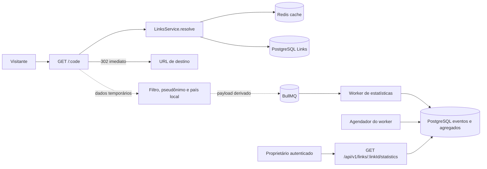

# Design: Estatísticas de Acesso dos Links

**SPEC:** `.specs/features/link-statistics/spec.md`  
**Contexto:** `.specs/features/link-statistics/context.md`  
**Status:** Implementado e validado  
**Criado em:** 14 de julho de 2026  
**Validado em:** 14 de julho de 2026

## Contexto e pesquisa

O contexto `LinkStatistics` é uma extensão independente do monólito modular: recebe dados derivados da resolução pública e consulta os Links somente para autorização do relatório. PostgreSQL é a fonte de verdade de eventos e agregados; Redis atende somente BullMQ e o cache de resolução já existente.

A pesquisa confirmou que BullMQ permite `jobId` customizado por fila, mas jobs removidos deixam de bloquear duplicatas. Portanto, o `jobId` é apenas uma otimização: a idempotência definitiva fica em constraints e transações PostgreSQL. A documentação oficial do `@maxmind/geoip2-node` confirma leitura local de arquivo MMDB por `Reader.open()` e consulta de país sem enviar IP a terceiros. Context7 não está disponível neste workspace; as fontes consultadas foram as documentações oficiais de BullMQ, NestJS Schedule e MaxMind.

## Visão da arquitetura

O middleware de resolução continuará emitindo `302` sem aguardar analytics. Antes de descartar IP e user-agent, ele filtra tráfego automatizado, gera o pseudônimo diário e resolve o país localmente. Apenas o payload derivado segue para BullMQ. O worker grava o Evento de Acesso e atualiza agregados em uma única transação. Um agendador executado exclusivamente no worker fecha dias UTC anteriores, remove eventos e chaves pseudonimizadas temporárias.

## Reuso de código

| Componente | Localização | Uso |
| --- | --- | --- |
| Resolução pública | `src/modules/links/register-public-link-resolve.ts` | Disparar coleta após uma resolução elegível, sem aguardar. |
| Serviço e repositório de Links | `src/modules/links/links.service.ts`, `links.repository.ts` | Retornar identidade pública do Link resolvido e validar propriedade do relatório. |
| Cache de resolução | `link-resolution-cache.service.ts`, `redis-link-resolution-cache.service.ts` | Passar a guardar `linkId` junto da URL de Destino em chave versionada. |
| Fila de e-mail | `src/redis.module.ts`, `queue-auth-email.service.ts` | Reutilizar BullMQ, constantes de job, interface abstrata e implementação concreta de coleta. |
| Worker | `src/worker.module.ts`, `src/worker.ts` | Hospedar processor e agendador sem iniciar tarefas na API. |
| Autorização e DTO | `auth-session.guard.ts`, `links.dto.ts` | Reutilizar `AuthSessionGuard`, `LinkIdParamDto` e o envelope de validação. |
| Repositórios TypeORM | `typeorm-links.repository.ts` | Reutilizar transações, outcomes explícitos e isolamento de entidades. |
| Crypto de Auth | `auth-crypto.service.ts` | Seguir o padrão HMAC, com segredo exclusivo para estatísticas. |
| Testes de fila sanitizada | `test/integration/auth-email.integration-spec.ts` | Validar que payload não contém IP nem user-agent. |

## Componentes e contratos

### Resolução de Link enriquecida

- **Localização:** `src/modules/links/links.service.ts`, `link-resolution-cache.service.ts` e `redis-link-resolution-cache.service.ts`
- **Papel:** devolver a identidade do Link ao middleware sem novo lookup no cache hit.
- **Contrato:**
  - `resolve(shortCode: string): Promise<ResolvedLink>`
  - `ResolvedLink = { linkId: string; destinationUrl: string }`
- **Decisão:** a chave Redis muda para `shortlink:links:resolution:v2:{shortCode}` e armazena uma representação serializada de `ResolvedLink`. A versão evita interpretar entradas antigas como dados estruturados.

### `LinkAccessCollector`

- **Localização:** `src/modules/link-statistics/link-access-collector.service.ts` e `queue-link-access-collector.service.ts`
- **Papel:** receber somente um `CollectedAccess` derivado e tentar enfileirar o job.
- **Contrato:** `collect(input: CollectedAccess): Promise<void>`
- **Regra:** o middleware chama sem `await` e captura a rejeição para log sanitizado. O job recebe `eventId`, `linkId`, `occurredAt`, `occurredOn`, `country` e `visitorPseudonym`; nunca IP, user-agent, URL de Destino ou headers.

### Preparação de acesso

- **Localização:** `src/modules/link-statistics/automated-traffic-detector.service.ts`, `visitor-pseudonymizer.service.ts` e `local-country-resolver.service.ts`
- **Papel:** converter a requisição efêmera no `CollectedAccess` seguro.
- **Contratos:**
  - `AutomatedTrafficDetector.isAutomated(userAgent: string): boolean`
  - `VisitorPseudonymizer.create(linkId: string, occurredOn: string, ip: string, userAgent: string): string`
  - `CountryResolver.resolve(ip: string): CountryCode`
- **Regra:** o detector usa uma lista estática versionada que cobre Google, Bing, Facebook, Twitter/X, Slack, Discord, LinkedIn e monitores de uptime; user-agent ausente permanece elegível. O pseudônimo é HMAC de `linkId`, data UTC, IP e user-agent usando `LINK_STATS_PSEUDONYM_SECRET`; `CountryResolver` lê MMDB local, trata IP inválido/privado, banco indisponível e ausência de correspondência como `Unknown`.

### `LinkStatisticsRepository`

- **Localização:** `src/modules/link-statistics/link-statistics.repository.ts` e `typeorm-link-statistics.repository.ts`
- **Papel:** persistir o evento e seus efeitos agregados de maneira transacional; consultar o relatório por período.
- **Contratos:**
  - `recordAccess(input: AccessEventInput): Promise<void>`
  - `finalizeDays(before: string): Promise<void>`
  - `getReport(linkId: string, period: StatisticsPeriod): Promise<LinkStatisticsReport>`
- **Regra:** `recordAccess` insere o Evento pelo `eventId`; conflito de chave é no-op. Quando a inserção é nova, incrementa o agregado diário por país e mensal; a inserção única em `link_daily_visitors` controla o incremento de visitantes únicos.

### `LinkStatisticsService` e controller

- **Localização:** `src/modules/link-statistics/link-statistics.service.ts`, `link-statistics.controller.ts` e `link-statistics.dto.ts`
- **Papel:** validar período UTC, verificar existência/propriedade do Link e retornar o relatório.
- **Contrato:** `getReport(userId: string, linkId: string, query: StatisticsPeriodQuery): Promise<LinkStatisticsReport>`
- **Rota:** `GET /api/v1/links/:linkId/statistics?from=YYYY-MM-DD&to=YYYY-MM-DD`.
- **Integração:** `LinkStatisticsController` usa o mesmo prefixo `links`, `AuthSessionGuard` e DTO de UUID; o `LinksModule` permanece responsável somente pelo ciclo de vida de Links.

### Processor e finalizador

- **Localização:** `src/modules/link-statistics/link-statistics.processor.ts` e `link-statistics-finalizer.service.ts`
- **Papel:** consumir `record-link-access` e, às 01:00 UTC no processo `queue-worker`, fechar dias UTC anteriores.
- **Decisão:** `@nestjs/schedule` é registrado exclusivamente em `WorkerModule`. A finalização usa lock transacional por dia de Link, marca o dia como fechado e remove Eventos e chaves diárias pseudonimizadas. Jobs atrasados para um dia fechado são no-op, preservando a idempotência e aceitando a perda best-effort definida na SPEC.

## Modelo de dados

| Tabela | Campos relevantes | Regras |
| --- | --- | --- |
| `link_access_events` | `id`, `linkId`, `occurredAt`, `occurredOn`, `country`, `visitorPseudonym` | `id` é o `eventId` da fila; excluída ao fechar o dia. |
| `link_daily_aggregates` | `linkId`, `occurredOn`, `country`, `accessCount`, `uniqueVisitorCount` | Unique `(linkId, occurredOn, country)`; preservada enquanto o Link existir. |
| `link_daily_visitors` | `linkId`, `occurredOn`, `visitorPseudonym`, `country` | Unique `(linkId, occurredOn, visitorPseudonym)`; o país da primeira inserção é definitivo para esse único e a linha existe somente até o fechamento diário. |
| `link_monthly_aggregates` | `linkId`, `occurredMonth`, `accessCount`, `dailyUniqueVisitorCount` | Unique `(linkId, occurredMonth)`; únicos são soma dos incrementos diários. |
| `link_statistics_days` | `linkId`, `occurredOn`, `finalizedAt` | Unique `(linkId, occurredOn)`; impede que jobs atrasados recriem dados de dia já fechado. |

Todas as tabelas referenciam `links.id` com `ON DELETE CASCADE`, para cumprir a retenção enquanto o Link existir. País usa código ISO 3166-1 alpha-2 ou o valor literal `Unknown`.

## Fluxos críticos

### Coleta sem bloquear redirecionamento

1. O middleware resolve `ResolvedLink` pelo cache-aside existente.
2. Ele emite `302` com a URL de Destino.
3. Em execução não aguardada, ignora user-agent automatizado conhecido; user-agent ausente continua elegível e gera `CollectedAccess` com dados derivados.
4. A coleta tenta adicionar job BullMQ com `jobId` igual a `access-{eventId}`.
5. Falhas são logadas sem dados sensíveis; não alteram a resposta já emitida.

### Processamento idempotente

1. O processor chama `recordAccess` em uma transação PostgreSQL.
2. Se `link_statistics_days` já tiver o dia fechado, retorna sem efeito.
3. Insere `link_access_events`; conflito do `eventId` retorna sem efeito.
4. Incrementa acesso diário por país e mensal.
5. Insere a chave diária do visitante; somente inserção nova incrementa únicos diário e mensal.
6. Commit torna evento e agregados consistentes.

### Fechamento diário

1. Às 01:00 UTC, o worker seleciona dias UTC anteriores ainda não fechados.
2. Para cada Link/dia, bloqueia ou cria `link_statistics_days`.
3. Remove eventos e chaves de visitantes daquele dia, marca-o como fechado e comita.
4. Eventos recebidos posteriormente para dia fechado são descartados.

## Configuração e dependências

| Item | Uso |
| --- | --- |
| `LINK_STATS_PSEUDONYM_SECRET` | Segredo obrigatório e exclusivo do HMAC diário. |
| `LINK_STATS_QUEUE_ATTEMPTS`, `LINK_STATS_QUEUE_BACKOFF_MS` | Retentativas e backoff da fila de estatísticas. |
| `GEOIP_COUNTRY_DB_PATH` | Caminho opcional do MMDB local; ausência ou erro resulta em `Unknown`. |
| `@maxmind/geoip2-node` | Leitura local do banco de país. |
| `@nestjs/schedule` | Agendamento do fechamento diário às 01:00 UTC apenas no worker. |

`docker-compose.yml` deve disponibilizar as variáveis para `api` e `queue-worker`; o MMDB deve ser montado ou copiado para ambos. Nenhuma dependência externa recebe o IP.

## Estratégia de erros

| Cenário | Tratamento | Impacto |
| --- | --- | --- |
| Cache Redis falha na resolução | Fallback atual para PostgreSQL | `302` preservado quando Link Ativo. |
| Fila indisponível | Log sanitizado e descarte do evento | `302` preservado; métrica pode faltar. |
| MMDB ausente, IP inválido ou sem match | País `Unknown` | Evento segue sem IP bruto. |
| Job duplicado ou retry BullMQ | Conflito do `eventId` é no-op | Sem inflação de agregados. |
| Dia já finalizado | Job tardio é no-op | Sem recriação de dados pseudonimizados. |
| User-agent ausente | Acesso continua elegível | Evita excluir visitantes legítimos sem assinatura automatizada. |
| Período inválido | `422 VALIDATION_ERROR` | Nenhuma consulta. |
| Link inexistente / alheio | `404 LINK_NOT_FOUND` / `403 FORBIDDEN` | Sem vazamento de relatório. |

## Decisões técnicas

| Decisão | Escolha | Motivo |
| --- | --- | --- |
| Fonte de verdade | Agregados e eventos em PostgreSQL | Redis/BullMQ não é banco de métricas. |
| Entrega | BullMQ fire-and-forget | Prioriza o caminho crítico do `302`. |
| Idempotência | `eventId` + constraints/transação | `jobId` BullMQ isoladamente não cobre jobs removidos. |
| Pseudonimização | HMAC diário por Link com segredo próprio | Impede correlação entre dias e Links. |
| País | MMDB local com fallback `Unknown` | Não transfere IP a terceiros. |
| Retenção | Fechamento diário às 01:00 UTC no worker | Oferece uma hora para fila e retries antes de remover dados pseudonimizados. |
| Agenda | `@nestjs/schedule` no worker | Evita tarefas recorrentes na API e reduz acoplamento com a fila. |
| Cache de resolução | Chave Redis `v2` com `linkId` | Coleta não precisa de nova consulta em cache hit. |

## Testes

| Camada | Cobertura |
| --- | --- |
| Unitário | Detector de bots, HMAC diário, resolver de país com fallback, período UTC, service de relatório e mapeamento de erros. |
| Integração | Payload BullMQ sanitizado, constraints de eventos/visitantes, incrementos transacionais, retry idempotente, finalização e limpeza. |
| E2E | `302` sem espera, indisponibilidade de fila sem impacto, relatório autorizado, período, 403/404 e Link Desativado com histórico. |

## Rastreabilidade

| Requisito | Componentes |
| --- | --- |
| LINK-STATS-001 | `LinkStatisticsModule`, interfaces, repositório e controller. |
| LINK-STATS-002 | Middleware público, `ResolvedLink`, collector e BullMQ. |
| LINK-STATS-003 | `AutomatedTrafficDetector`. |
| LINK-STATS-004 | Pseudonimizador, resolver local e payload derivado. |
| LINK-STATS-005 | Entidades, repositório e processor transacional. |
| LINK-STATS-006 | Finalizador, tabelas efêmeras e FKs. |
| LINK-STATS-007/008 | Controller, DTO e `LinkStatisticsService`. |
| LINK-STATS-009 | Fire-and-forget, fallback e logs sanitizados. |
| LINK-STATS-010 | Integração versionada no cache e contratos preservados. |
